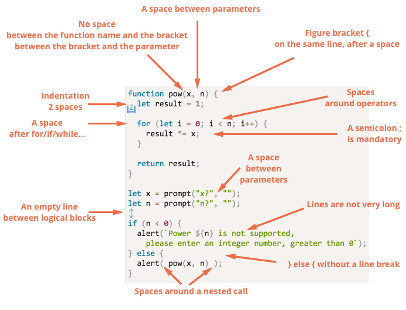
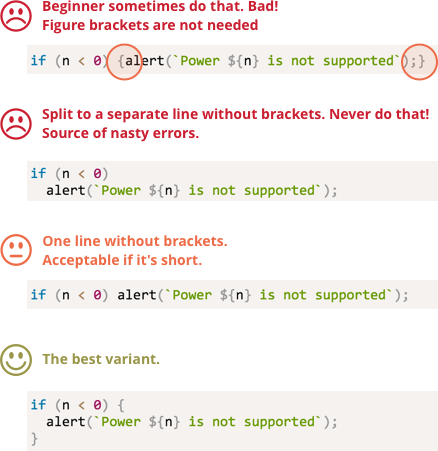

# Coding style
我们的代码必须尽可能地简洁和便于阅读

将一个复杂的任务或一段复杂的代码转换为即正确，可读性又强是一张编程的艺术

其中一种有效的方法就是良好的代码风格

## Syntax 语法
下图就是一些良好的代码风格的规则：



接下来我们来讨论上述规则和遵循他们的原因

记住规则是可以变得，而不是死的

## Figure brackets 大括号
在大多数的`JavaScript`项目中大括号都是写在同一行中，而不是新的一行。这种写法也可以成为`egyptian`写法，其中大括号两旁都由一个空格隔开。

有一个特殊的情况，单行的`if/for`语句，我们是否应该使用大括号呢？如果应该使用，那应该在哪里使用？

注意看下图的比较:



我们来总结一下：
> * 对于真的很短的代码，写在一行是可以接受的，比如 `if (cond) return null`
> * 通常每个大括号单独一行代码会更优雅

## Line length 缩进
两种缩进方式
>* **水平缩进：2（4）个空格**

使用2个空格或者4个空格或者`Tab`进行水平缩进。使用哪个更合理已经是老生常谈的事了，但是现在使用空格进行缩进方式更加统一了。

与使用`Tab`缩进相比，使用空格进行缩进的好处之一就是开发人员可以更灵活地配置缩进。

例如，我们可以将参数与括号对齐：
```js
show(parameters,
     aligned, // 5 spaces padding at the left
     one,
     after,
     another
  ) {
    // ...
}
```

>* **垂直缩进：用于分割逻辑模块的空白行**
一个函数通常可以被分割为几个逻辑模块。如下例子所示：初始化参数，主循环，返回值
```js
function pow(x, n) {
  let result = 1;
  //
  for (let i = 0; i < n, i++) {
    result *= x;
  }
  //
  return result;
}
```
添加一个额外的行可以使代码可读性增强。代码中不因该出现超过9行还没有一行垂直缩进。

## A semicolon 分号
分号应该出现在每条语句的后面，就算它可以跳过。

在`JavaScript`中，有时候换行并不会被解释为一个分号，这样就会造成一种编译错误，这时候分号就应该放在换行处。

## Nesting levels 嵌套级别
代码中不应该有太多的嵌套

有时候在`if(...) { ... };`中使用`continue`来直接避免额外嵌套不失为一种好方法。

例如：

我们不这样写：
```js
for (let i = 0; i < 10; i++) {
  if (cond) {
    // <- one more nesting level
  }
}
```

我们可以这样写：
```js
for (let i = 0; i < 10; i++) {
  if (!cond) continue;
  // <- no extra nesting level
}
```
同样在`if/else`和`return`中我们也可以做相同的操作。

比如，下面两段代码效果是相同的。

第一个：
```js
function pow(x, n) {
  if (n < 0) {
    alert("Negative 'n' not supported");
  } else {
    let result = 1;

    for (let i = 0; i < n; i++) {
      result *= x;
    }

    return result;
  }
}
```

第二个：
```js
function pow(x, n) {
  if (n < 0) {
    alert("Negative 'n' not supported");
    return;
  }

  let result = 1;

  for (let i = 0; i < n; i++) {
    result *= x;
  }

  return result;
}
```

显然，第二段代码的可读性更强，因为该段首先处理了极端情况`n < 0`，然后再进行不带任何嵌套的主逻辑处理。

## Functions below the code
如果你正在写一些关于函数的注释，下面有三种方法来规范它

1. 函数声明在函数调用前
```js
// function declarations
function createElement() {
  ...
}

function setHandler(elem) {
  ...
}

function walkAround() {
  ...
}

// the code which uses them
let elem = createElement();
setHandler(elem);
walkAround();
```

2. 先调用，后声明
```js
// the code which uses them
let elem = createElement();
setHandler(elem);
walkAround();

// --- helper functions ---
function createElement() {
  ...
}

function setHandler(elem) {
  ...
}

function walkAround() {
  ...
}
```

3. 混合使用，在需要对函数进行调用时再声明这个函数。

很多时候，第二种方法更好。

因为在开发人员阅读代码时，我们首先想知道这些是干嘛用的。如果函数声明在前，那就应该提供函数的相关信息。有时候我们并不需要完全阅读函数代码，特别是像它们的名字就足够让开发人员知道它们是用来干嘛的这种情况。

## Automated linters 自动检验工具
现在我们有着很多代码风格自动检验工具。

比较有名的有如下三种：
>* JSLint
>* JSHint
>* ESLint

下面我们来介绍一下 `ESLint`。

1. 安装`Node.JS`
2. 使用命令行`npm install -g eslint`安装`ESLint`
3. 创建一个名为`.eslintrc`的配置文件在你的`JavaScript`项目的根目录下

下面是一个`.eslintrc`的例子：
```json
{
  "extends": "eslint: recommended",
  "env": {
    "browser": true,
    "node": true,
    "es6": true
  },
  "rules": {
    "no-console": 0,
  },
  "indent": 2
}
```

## Summary 总结
这章节的所有的语法规则都是为了增强代码可读性，所以它们也是存在争议的。

去阅读更新的语法规则，去尝试它，你就会发现最好的语法规则。