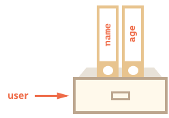
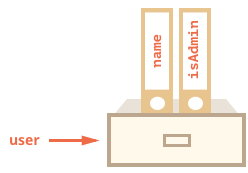

# Objects
我们可以从`Data types`的章节中直到，`JavaScript`中有7种语言类型，其中6种被称为原始类型。因为它们的值很简单，不是字符串就是数字或者其他。

然而，对象用于存储各种键值对和更复杂的实体。在`JavaScript`中，对象几乎渗透到了语言的各个方面。因此我们必须先了解它们才能对`JavaScript`进行更进一步的研究。

对象可以用大括号`{...}`附加上一系列的属性选项来创建。每个属性都是一对键值对，其中键`key`为字符串，也称为属性名称，而值`value`可以为任何东西。

我们可以将对象想象成一个文件柜。每一块数据通过键`key`来存储在各自的文件夹中，这样我们就可以很容易通过文件的名字来添加或者删除文件了。


空对象可以用如下两种语法来创建：

```js
let user = new Object(); // "object constructor" syntax
let user = {}; // "object literal" syntax
````


通常，我们使用大括号来创建空对象。

# Literals and properties
我们可以在大括号中添加键值对。

```js
let user = {
    name: "John",
    age: 30
}
```

一个属性值有一个键在`":"`的左边，和一个值在它的右边。

在`user`对象中就有两个属性：

1. 第一个属性有一个名字键：`"name"`和一个值：`"John"`
2. 第二个属性有一个名字键：`"age"`个一个值：`30`

`user`对象也可以想象成一个放着有两个文件的抽屉。



我们可以随时从抽屉中增加，查阅和取出文件。

属性值可以通过`.`来进行访问

```js
alert(user.name);
alert(user.age);
```

属性值可以为任意类型。让我们来添加一个布尔值：

```js
user.isAdmin = true;
```


我们可以使用`delete`来移除属性

```js
delete user.age;
```



我们还可以使用多字属性名，但它们必须使用引号括起来：

```js
let user = {
    name: "John",
    age: 30,
    "like birds": true
}
```


## Trailing comma
在列表中的最后一个属性带有`,`：

```js
let user = {
    name: "John",
    age: 30,
}
```

这个叫尾逗号或者悬挂都好。因为所有行都是类似的，这样可以更加容易添加/移除/移动属性。

## Square brackets
对于多字属性名，我们无法通过点来进行访问

```js
// this would give a synatax error
```

这是因为点访问要求键为合法的变量标识符，也就是没有任何空格和其他限制。

下面有一种中括号访问方式适用于任何字符串：

```js
let user = {};

// set
user["like birds"] = true;

// get 
alert(user["like birds"]);  // true

// delete
delete user["like birds"];
```

请谨记中括号内必须使用引号将键包括起来。

中括号同样了提供了一种使用任意表达式来表示键，而不是字面字符串来获取值：

```js
let key = "likes birds";

// same as user["likes birds"] = true
user[key] = true;
```

这里，变量`key`可以在程序运行时或者等待用户输入后计算出值，然后我们就可以获取相应的属性值，这为我们提供了巨大的便利性。点访问形式无法进行相同的操作。

```js
let user = {
    name: "John",
    age: 30
};

let key = prompt("What do you want to know about the user?", "name");

// access by variable
alert(user[key]);   // Jon (if enter "name")
```

## Computed properties
我们可以在一个对象中使用中括号，这也叫做计算属性。

```js
let fruit = prompt("Which fruit to buy?", "apple");

let bag = {
    [fruit]: 5,
};

alert(bag.apple);
```

计算属性的意思很明了： `[fruit]`表示属性名将会被`fruit`所代替。

所以，如果用户输入`"apple"`，`bag`将会变成`{apple: 5}`

同样，如下方法也可行：

```js
let fruit = prompt("Which fruit to buy?", "apple");
let bag = {};

// take property name from the fruit variable
bag[fruit] = 5;
```

这样看起来更加美观了。

我们还可以在中括号内使用更复杂的表达式：

```js
let fruit = 'apple';
let bag = {
    ['apple' + 'Computers']: 5  // bag.appleComputers = 5
}
```